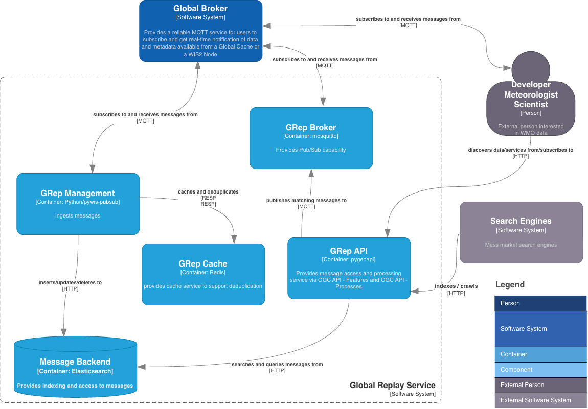

[](https://github.com/wmo-im/wis2-grep/actions)

# wis2-grep

wis2-grep is a Reference Implementation of a WIS2 Global Replay Service.

<a href="docs/architecture/c4.container.png"></a>

## Workflow

- connects to a WIS2 Global Broker, subscribed to the following topics:
  - `origin/a/wis2/#` and `cache/a/wis2/#`
- on notification messages
  - check for message duplication
  - publish to a WIS2 Global Replay Service (OGC API - Features) using one of the supported transaction backends:
    - Elasticsearch direct (default)
- user-defined subscriptions
  - users can execute a process to subscribe to notification messages based on topic and/or datetime

## Installation

### Requirements
- Docker

### Dependencies
Dependencies are embedded in service definitions and orchestrated by Docker.

### Installing wis2-grep

```bash
# setup virtualenv
python3 -m venv --system-site-packages wis2-grep
cd wis2-grep
source bin/activate

# clone codebase and install
git clone https://github.com/wmo-im/wis2-grep.git
cd wis2-grep-management
python3 setup.py install
```

## Running

```bash
# setup environment and configuration
cp wis2-grep.env local.env
vim local.env # update accordingly

source local.env

# setup pywis-pubsub - sync WIS2 notification schema
pywis-pubsub schema sync

# setup backends
wis2-grep setup wis2-notification-messages
wis2-grep setup wis2-monitoring-event-messages

# setup backends (force reinitialization of backends)
wis2-grep setup wis2-notification-messages --force
wis2-grep setup wis2-monitoring-event-messages --force

# teardown backends
wis2-grep teardown wis2-notification-messages
wis2-grep teardown wis2-monitoring-event-messages

# get retention policies
wis2-grep get-retention wis2-notification-messages
wis2-grep get-retention wis2-monitoring-event-messages

# get/set retention policies (hours)
wis2-grep set-retention wis2-notification-messages 24
wis2-grep set-retention wis2-monitoring-event-messages 168

# connect to Global Broker
# notifications will automatically trigger wis2-grep to publish
# WNM to the API identified in wis2-grep.env (WIS2_GREP_GB)
pywis-pubsub subscribe --config pywis-pubsub.yml

# loading notification messsage manually (single file)
wis2-grep load /path/to/wnm-or-wmem-file.json

# loading notification messages manually (directory of .json files)
wis2-grep load /path/to/dir/of/wnm-or-wmem-files

# manually clean messages from API indexes
wis2-grep clean wis2-notification-messages --hours 24
wis2-grep clean wis2-monitoring-event-messages --hours 24
```

### Docker

The Docker setup uses Docker and Docker Compose to manage the following services:

- **wis2-grep-api**: API powered by [pygeoapi](https://pygeoapi.io)
- **wis2-grep-broker**: MQTT broker
- **wis2-grep-management**: management service to publish notification and monitoring event messages published from a WIS2 Global Broker instance
  - the default Global Broker connection is to NOAA.  This can be modified in `wis2-grep.env` to point to a different Global Broker
- **wis2-grep-backend**: API search engine backend (default Elasticsearch)
- **wis2-grep-cache**: message cache (default Redis)

See [`wis2-grep.env`](wis2-grep.env) for default environment variable settings.

NOTE: to configure message retention, set ``WIS2_GREP_MESSAGE_RETENTION_HOURS`` accordingly

To adjust service ports, edit [`docker-compose.override.yml`](docker-compose.override.yml) accordingly.

The [`Makefile`](Makefile) in the root directory provides options to manage the Docker Compose setup.

```bash
# build all images
make build

# build all images (no cache)
make force-build

# start all containers
make up
# API is up at http://localhost:8000

# reinitialize backend
make reinit-backend

# start all containers in dev mode
make dev
# API is up at http://localhost:8000

# view all container logs in realtime
make logs

# login to the wis2-grep-management container
make login

# restart all containers
make restart

# shutdown all containers
make down

# remove all volumes
make rm
```

## API queries

```bash


## WIS2 notification messages

# by topic
curl "http://localhost:8000/collections/wis2-notification-messages/items?q=%22cache/a/wis2%22"

# by bounding box (Canada):
curl "http://localhost:8000
/collections/wis2-notification-messages/items?bbox=-142,42,-5,84"

# by publication time (from/to):
curl "http://localhost:8000/collections/wis2-notification-messages/items?datetime=2024-07-24T11:11:11Z/2024-07-25T12:34:21Z"

# by publication time (from):
curl "http://localhost:8000/collections/wis2-notification-messages/items?datetime=2024-07-24T11:11:11Z/.."

# by publication time (to):
curl "http://localhost:8000/collections/wis2-notification-messages/items?datetime=../2024-07-24T11:11:11Z"

# by message identifier
curl "http://localhost:8000/collections/wis2-notification-messages/items/<WNM_ID>"

# sort results by oldest messages (pubtime)
curl "http://localhost:8000/collections/wis2-notification-messages/items?sortby=pubtime"

# sort results by latest messages (pubtime)
curl "http://localhost:8000/collections/wis2-notification-messages/items?sortby=-pubtime"

# return as GeoJSON
curl "http://localhost:8000/collections/wis2-notification-messages/items?f=json"

# return as HTML
curl "http://localhost:8000/collections/wis2-notification-messages/items?f=html"

## WIS2 monitoring event messages

# by topic
curl "http://localhost:8000/collections/wis2-monitoring-event-messages/items?q=%22monitor/b/wis2/ca-eccc-msc%22"

# by publication time (from/to):
curl "http://localhost:8000/collections/wis2-monitoring-event-messages/items?datetime=2024-07-24T11:11:11Z/2024-07-25T12:34:21Z"

# by publication time (from):
curl "http://localhost:8000/collections/wis2-monitoring-event-messages/items?datetime=2024-07-24T11:11:11Z/.."

# by publication time (to):
curl "http://localhost:8000/collections/wis2-monitoring-event-messages/items?datetime=../2024-07-24T11:11:11Z"

# by message identifier
curl "http://localhost:8000/collections/wis2-monitoring-event-messages/items/<WME_ID>"

# sort results by oldest messages (pubtime)
curl "http://localhost:8000/collections/wis2-monitoring-event-messages/items?sortby=time"

# sort results by latest messages (pubtime)
curl "http://localhost:8000/collections/wis2-monitoring-event-messages/items?sortby=-time"

# return as GeoJSON
curl "http://localhost:8000/collections/wis2-monitoring-event-messages/items?f=json"

# return as HTML
curl "http://localhost:8000/collections/wis2-monitoring-event-messages/items?f=html"
```

## Development

### Running Tests

TODO

### Code Conventions

* [PEP8](https://www.python.org/dev/peps/pep-0008)

### Bugs and Issues

All bugs, enhancements and issues are managed on [GitHub](https://github.com/wmo-im/wis2-grep/issues).

## Contact

* [Tom Kralidis](https://github.com/tomkralidis)
