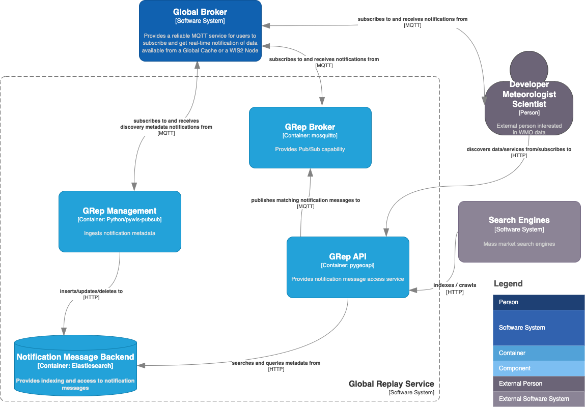

[](https://github.com/wmo-im/wis2-grep/actions)

# wis2-grep

wis2-grep is a Reference Implementation of a WIS2 Global Replay Service.

<a href="docs/architecture/c4.container.png"></a>

## Workflow

- connects to a WIS2 Global Broker, subscribed to the following topic:
  - `origin/a/wis2/#`
- on notification messages
  - publish to a WIS2 Global Replay Service (OGC API - Features) using one of the supported transaction backends:
    - [OGC API - Features - Part 4: Create, Replace, Update and Delete](https://docs.ogc.org/DRAFTS/20-002.html)
    - Elasticsearch direct (default)
- user-defined subscriptions
  - users can execute a process to subscribe to notification messages based on topic and/or datetime

## Installation

### Requirements
- Python 3
- [virtualenv](https://virtualenv.pypa.io)

### Dependencies
Dependencies are listed in [requirements.txt](requirements.txt). Dependencies
are automatically installed during pywis-pubsub installation.

### Installing wis2-grep

```bash
# setup virtualenv
python3 -m venv --system-site-packages wis2-grep
cd wis2-grep
source bin/activate

# clone codebase and install
git clone https://github.com/wmo-im/wis2-grep.git
cd wis2-grep-management
python3 setup.py install
```

## Running

```bash
# setup environment and configuration
cp wis2-grep.env local.env
vim local.env # update accordingly

source local.env

# setup pywis-pubsub - sync WIS2 notification schema
pywis-pubsub schema sync

# setup backend
wis2-grep setup

# teardown backend
wis2-grep teardown

# connect to Global Broker
# notifications will automatically trigger wis2-grep to publish
# WNM to the API identified in wis2-grep.env (WIS2_GREP_GB)
pywis-pubsub subscribe --config pywis-pubsub.yml

# loading notification messsage manually (single file)
wis2-grep register /path/to/wnm-file.json

# loading notification messages manually (directory of .json files)
wis2-grep load /path/to/dir/of/wnm-files
```

### Docker

The Docker setup uses Docker and Docker Compose to manage the following services:

- **wis2-grep-api**: API powered by [pygeoapi](https://pygeoapi.io)
- **wis2-gdc-broker**: MQTT broker
- **wis2-grep-management**: management service to publish notification messages published from a WIS2 Global Broker instance
  - the default Global Broker connection is to NOAA.  This can be modified in `wis2-grep.env` to point to a different Global Broker
- **wis2-grep-backend**: API search engine backend (default Elasticsearch)

See [`wis2-grep.env`](wis2-grep.env) for default environment variable settings.

To adjust service ports, edit [`docker-compose.override.yml`](docker-compose.override.yml) accordingly.

The [`Makefile`](Makefile) in the root directory provides options to manage the Docker Compose setup.

```bash
# build all images
make build

# build all images (no cache)
make force-build

# start all containers
make up
# API is up at http://localhost

# start all containers in dev mode
make dev
# API is up at http://localhost

# view all container logs in realtime
make logs

# login to the wis2-grep-management container
make login

# restart all containers
make restart

# shutdown all containers
make down

# remove all volumes
make rm
```

## Development

### Running Tests

```bash
# install dev requirements
pip3 install -r requirements-dev.txt

# run tests like this:
python3 tests/run_tests.py

# or this:
python3 setup.py test
```

### Code Conventions

* [PEP8](https://www.python.org/dev/peps/pep-0008)

### Bugs and Issues

All bugs, enhancements and issues are managed on [GitHub](https://github.com/wmo-im/wis2-grep/issues).

## Contact

* [Tom Kralidis](https://github.com/tomkralidis)
